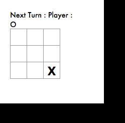

# Tic-tac-toe-in-JS
A SIMPLE TIC-TAC-TOE GAME IN JAVASCRIPT

# About game
2 player X & O, by default, when any square is clicked X is marked and then player O and so on. This is human vs human, which can be played by 2 person or single person. The result is displaying after if the match draw and if the match won by any of the player, the winner is displayed.

# Game Board
 
 

(1) Grid layout

The game grid is represented in the array Grid.cells as follows:

[0] [1] [2]
[3] [4] [5]
[6] [7] [8]

The cells (array elements) hold the following numeric values:
0 if not occupied, 1 for player, 3 for computer.
This allows us to quickly get an overview of the game state:
if the sum of all the cells in a row is 9, the computer wins,
if it is 3 and all the cells are occupied, the human player wins,
etc.

(2) Strategy of makeComputerMove()

The computer first  looks for almost completed rows, columns, and
diagonals, where there are two fields occupied either by the human
player or by the computer itself. If the computer can win by
completing a sequence, it does so; if it can block the player from
winning with the next move, it does that. If none of that applies,
it plays the center field if that's free, otherwise it selects a
random free field. This is not a 100 % certain strategy, but the
gameplay experience is fairly decent.

